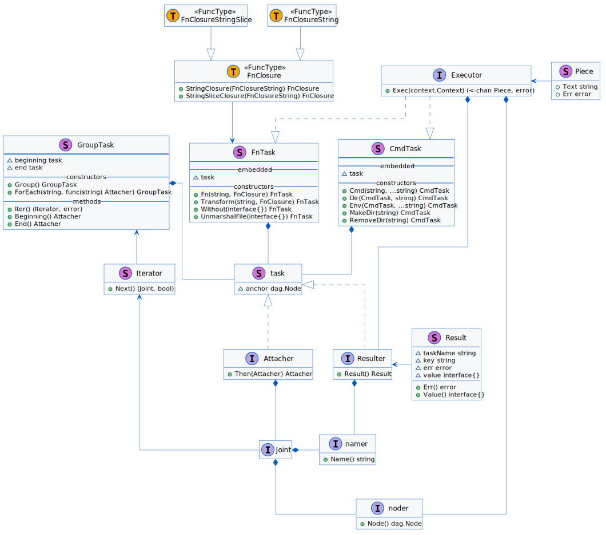
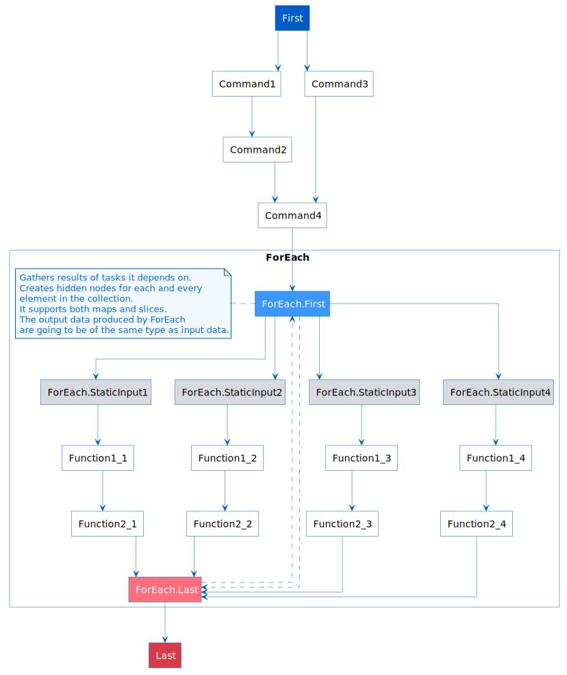

# rosie

[](http://godoc.org/github.com/travelaudience/rosie)


A library for workflow modelling and task interaction description.

It makes a job easier by abstracting away the interaction with a command line interface.
As a result, there is little difference between executing a program or a go code.
It reduces the need to reinvent the wheel to a complete minimum by making existing and battle-tested CLI applications as easy to integrate as possible.

Built around the [directed acyclic graph (DAG)](https://en.wikipedia.org/wiki/Directed_acyclic_graph) allows for expressing non-trivial procedures.
The library makes describing complex workflows possible which consist of tasks that have multiple parents or multiple children, and rely on the outcome of previous tasks execution.

## Motivation

As our organization grows, our need for standardization grows as well.
That need materializes in many ways.

### Automation
The more we improve our CI/CD pipelines, any differences between each team and project become harder to justify.
The more complex and opinionated automation become, the more constraints it enforces on developers.
Each time a pipeline is getting changed in a significant way, developer involvement in CI/CD is harder to maintain.

It is especially visible in the world of [GitOps](https://www.quora.com/What-is-GitOps) where tons of files float around multiple repositories.
While it is handy to have such a single source of truth, over time it becomes harder to refactor or migrate.
And last but not least, developers get exposed to this entire complexity and inconsistency (of form).

### Codebase

Go community created plenty of great tools.
Beginning from static analysis tools like [staticcheck](https://github.com/dominikh/go-tools/tree/master/cmd/staticcheck) and [gosec](https://github.com/securego/gosec),
throughout tools that helps to manage codebase like [goimports](https://godoc.org/golang.org/x/tools/cmd/goimports),
up to code generators like [stringer](https://godoc.org/golang.org/x/tools/cmd/stringer) or [protoc-gen-go](https://github.com/golang/protobuf/tree/master/protoc-gen-go).
Both Go and Unix shares the same philosophy [_Do One Thing and Do It Well_](https://en.wikipedia.org/wiki/Unix_philosophy).
It is a great way of thinking about Technology, but it stands somehow against standardisation.

### Conclusion

Having a tool tailored for specific company needs is beneficial in both cases.
Such a tool could help to establish a baseline of non-opt-out rules:
* It would reduce the number of repository-specific scripts and configuration files.
* By moving developers further away from configuration it would be possible to slowly evolve an ecosystem
with users not (most of the time) being even aware of the changes.
* Having it programmed in Go makes the tool easy to distribute.

Exactly this use case is the reason why this library exist.
The problem it solves is generic enough so we decided to extract it away and open-source.


### Quick Start

To start with the library simply import it within your code:
```go
import . "github.com/travelaudience/rosie"
```

A `Task` is the basic building block.
But it is not the one that can **_run_**.
A `TaskGroup` is minimal what you need in order to do something productive.

```go
group := Group("build")
group.Beginning().
    Then(Cmd("go-list", "go", "list", "-f", `"{{.ImportPath}}%{{.Name}}"`, "./cmd/...")).
    Then(Transform("filter", filterPackages)).
    Then(ForEach("go-build", func(name string) Attacher {
        return Env(Cmd(name, "go", "build", "-ldflags", formatLDFlags(), "-a", "-o", "./bin/[[ .Result.Value.Name ]]", "./cmd/[[ .Result.Value.Name ]]"), bo.env()...)
    }))
```

The example above shows how potentially multiple `main` packages located in `./cmd` directory could be compiled.
It has 3 steps:

* List all packages located in `./cmd` directory.
* Filter out those that name is not `main`.
* Execute `go build` for each and every `ImportPath` that was found.

This example, even if simple, demonstrates quite well what can be achieved using this library.
Let's go through the example.
The first thing we have to do is to create a `TaskGroup`.
`TaskGroup` is, in fact, a simple graph with only one edge that connects its `Beginning` and the `End`.

Both `Task` and `TaskGroup` implements `Attacher` interface.
`Then` adds an `Attacher` after another (chain them).
Because in the case of `TaskGroup` `Then` simply wraps `.End().Then()` we have to refer to the `Beginning`.
Using an `Attacher` that is returned by the `Beginning` we can literally fill up our first `TaskGroup` with steps.

Once we have our root `TaskGroup` completed, it's time to run it!
The library provides ready to use `clirunner` package:

```go
import "github.com/travelaudience/rosie/pkg/runner/clirunner"
```

It is always good to set up an upper time limit in which the entire workflow needs to complete.
For that reason, the runner accepts `context.Context`.

```go
ctx, cancel := context.WithTimeout(context.Background(), 1*time.Minute)
defer cancel()

err := clirunner.Run(ctx, io.Stdout, group, clirunner.VerbosityOpts{
    Output: true,
    Task:   true,
})
if err != nil {
	fmt.Println(err)
	os.Exit(1)
}

```

For more documentation and examples, please visit [godoc.org](https://github.com/travelaudience/rosie).

## Design

TODO: explanation



TODO: explanation



## Contributing

Contributions are welcomed! Read the [Contributing Guide](CONTRIBUTING.md) for more information.

## Licensing

This project is licensed under the MIT License - see the [LICENSE](LICENSE.txt) file for details

